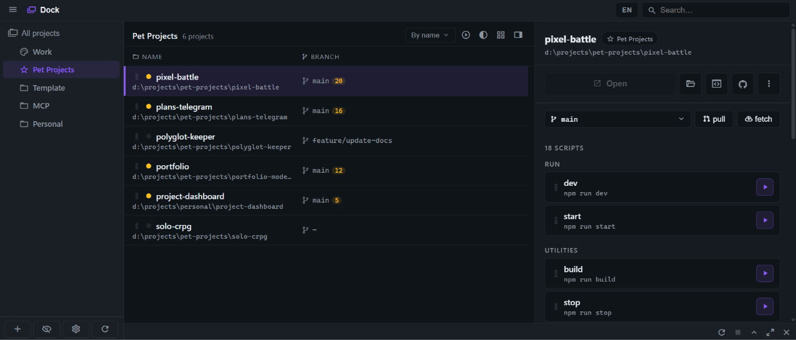

<div align="center">


# Dock

[](LICENSE)
[](https://nodejs.org/)




</div>

Local multi-project hub for developers. Run npm scripts, git commands, and a built-in terminal — with categories, filters, and a Windows system tray. No accounts, no cloud, zero runtime npm dependencies for the server itself.

**A project is any folder on disk.** Git and `package.json` are optional.

Built with plain Node.js + a small optional .NET tray on Windows.

Repository: [github.com/davidaganov/dock](https://github.com/davidaganov/dock)

## Requirements

- [Node.js](https://nodejs.org/) 18+
- Git (optional, for pull / fetch / checkout)
- Windows tray: [.NET SDK](https://dotnet.microsoft.com/download) 10+ (only to build the tray app)

## Quick start

### Windows (recommended)

```bat
start-win.bat
```

| Command                 | What it does                               |
| ----------------------- | ------------------------------------------ |
| `start-win.bat`         | System tray (builds `Dock.exe` if missing) |
| `start-win.bat console` | Visible server window + browser            |
| `start-win.bat server`  | Node only (used by the tray)               |

UI: http://127.0.0.1:3848

### macOS / Linux

```bash
chmod +x start.sh
./start.sh background   # background + browser
./start.sh foreground   # current terminal
./start.sh stop
./start.sh status
```

Or:

```bash
npm start
```

macOS / Linux are not personally tested yet. If something breaks, feedback is welcome in Telegram: [@davidaganov](https://t.me/davidaganov).

## First launch

1. Choose a **workspace folder** (e.g. `~/projects` or `D:\projects`)
2. Point to **projects.json** (see below)
3. Add folders or create / clone projects into categories

## Project Manager + `projects.json`

Dock stores the project list in a `projects.json` file that is compatible with the [Project Manager](https://marketplace.visualstudio.com/items?itemName=alefragnani.project-manager) extension for VS Code / Cursor.

1. Install **Project Manager**
2. Set **Project Manager: Projects Location** to the folder that contains `projects.json` (for example `D:/projects`)
3. Keep the list in sync from either side — Dock watches the file and picks up external edits
4. Switch between projects quickly from the IDE sidebar

Categories in Dock map to Project Manager groups (e.g. `01. Work`, `02. Personal`).

## Features

- **Shared project list** with IDE Project Manager via `projects.json` (watched live)
- **Category sidebar** with drag-and-drop order and optional numeric prefixes (`01. …`)
- **Table / card views**, filters, and custom project order
- **One-click** npm / pnpm / yarn scripts
- **Integrated terminal** with session tabs and real-time SSE logs
- **Create** empty folders or **clone** repos into a category
- **Windows system tray** for background server + quick open
- **English / Russian** UI (tray follows the same locale)
- **Hidden projects** via the `__hidden__` tag

## Configuration

Local file `dock-config.json` (gitignored) stores paths, onboarding flag, and UI preferences.

Example: [`dock-config.example.json`](dock-config.example.json)

```json
{
  "homePath": "D:\\projects",
  "projectsJsonPath": "D:\\projects\\projects.json",
  "onboardingCompleted": true,
  "locale": "en"
}
```

`projects.json` — array of projects with stable UUIDs (also consumed by Project Manager):

```json
[
  {
    "id": "550e8400-e29b-41d4-a716-446655440000",
    "name": "my-app",
    "rootPath": "D:\\projects\\my-app",
    "tags": ["personal"],
    "enabled": true
  }
]
```

## Project layout

```
dock/
├── server.js           # entry
├── src/                # Node server (see src/README.md)
│   ├── core/
│   ├── config/
│   ├── projects/
│   ├── runtime/
│   ├── system/
│   └── routes/
├── public/             # browser UI + locales
├── tray/               # Windows tray (.NET)
├── assets/             # logo + screenshot for README
├── start-win.bat
├── start.sh
└── dock-config.json    # local only (gitignored)
```

## Development

```bash
npm install
npm start
npm run format          # prettier
npm run format:check    # prettier
npm run translate       # polyglot-keeper
npm run tray:build
```

Copy [`.env.example`](.env.example) to `.env` for locale sync. Config: [`polyglot.config.json`](polyglot.config.json) (`en` is the source locale, files in `public/locales`).

## License

MIT © [David Aganov](https://aganov.dev)
